# モジュール 4: Azure Arc 対応サーバーの Update Manager

このモジュールでは、Azure Arc で接続されたオンプレミス Windows サーバーに対して、**Update Manager** を使用したパッチ管理の方法を学びます。

## 目標

このモジュールを完了すると、以下のスキルが習得できます：

1. Update Manager の基本概念を理解する
2. Azure Arc 対応サーバーへの Update Manager の適用
3. 定期評価の有効化と更新設定の構成
4. 更新コンプライアンスの確認
5. スケジュールに基づく定期更新の設定（メンテナンス構成）
6. オンデマンド（個別適用）による更新の実施
7. 更新履歴の監視とレポート確認

## モジュールの所要時間

- 予定時間：60～90 分
- ハンズオン実習含む

## 前提条件

このモジュールを開始する前に、以下を確認してください：

- ✅ Azure Arc によるサーバー接続が完了していること（モジュール 2）
- ✅ 対象サーバーのエージェントが接続状態であること
- ✅ Azure ポータルへのアクセス権があること
- ✅ 対象サーバーに対する **Contributor** または **Azure Connected Machine の所有者** ロールがあること

## Update Manager とは

### 概要

**Update Manager** は、Azure Arc 対応サーバーや Azure VM の パッチ適用を一元管理するサービスです。
複数のサーバーの更新を効率的に管理し、定期的なメンテナンス ウィンドウ内での自動更新をスケジュールできます。

### 主な機能

| 機能 | 説明 |
|------|------|
| **更新コンプライアンス監視** | サーバーの更新状況をリアルタイムで把握 |
| **スケジュール更新** | メンテナンス ウィンドウ内での自動更新 |
| **段階的なロールアウト** | 段階 1、段階 2 に分けた計画的な展開 |
| **事前確認チェック** | 更新前の前提条件を自動確認 |
| **更新履歴** | 適用済み更新と保留中の更新を追跡 |

## タスク 1: 対象サーバーの確認

まず、Update Manager を適用するサーバーが正しく接続されていることを確認します。

### 手順 1-1: Azure ポータルでサーバーを確認

1. [Azure ポータル](https://portal.azure.com) にサインインします
2. 上部検索バーで「**Azure Arc**」と入力し、検索結果から「**Azure Arc**」をクリック
3. 左メニューから「**マシン**」をクリック

   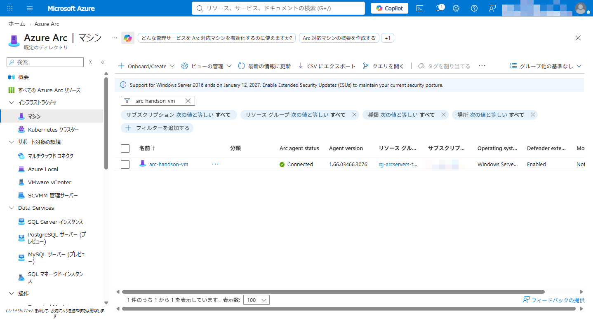

4. 対象のサーバーが表示され、**状態が「接続済み」** であることを確認します

   > 例：`arc-server-01` の状態が「接続済み」と表示されていることを確認

### 手順 1-2: サーバー詳細の確認

1. 対象サーバーをクリックして詳細ページを開く
2. 以下の情報が正常に表示されていることを確認します：
   - **ステータス**：「接続済み」
   - **OS タイプ**：「Windows」
   - **オペレーティング システム**：「Windows Server」

   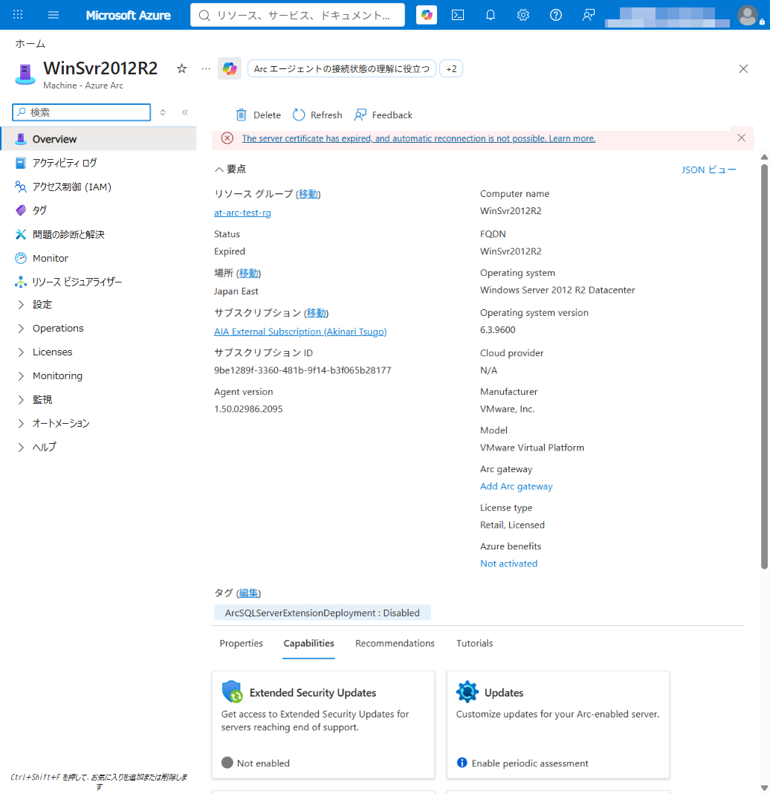

## タスク 2: 定期評価の有効化と更新設定の構成

定期評価を有効にすることで、Update Manager がサーバーの更新状態を自動的に定期確認するようになります。

### 手順 2-1: Update Manager にアクセス

1. Azure ポータルの上部検索バーで「**Update Manager**」と入力
2. 検索結果から「**Update Manager**」をクリック

   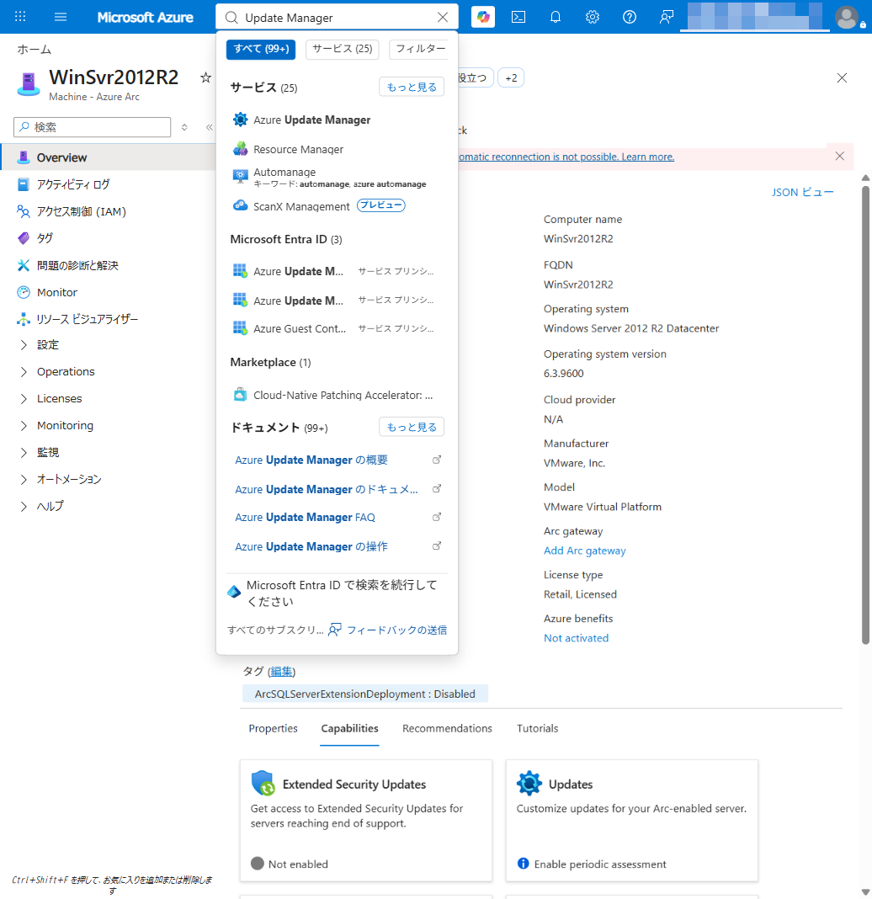

3. **Azure Update Manager** のページが開きます

   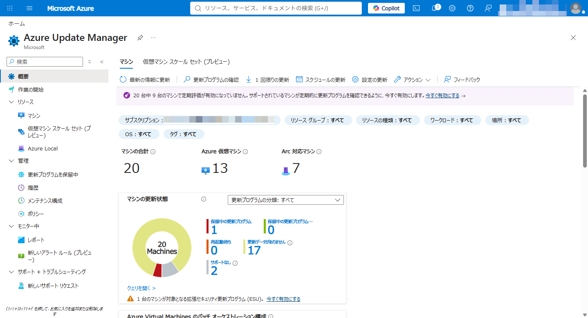

### 手順 2-2: マシン一覧で定期評価の状態を確認

1. 左メニュー「**リソース**」→「**マシン**」をクリック

2. 対象のサーバーが一覧に表示されます
   - 「定期評価」列が「**無効**」の場合、定期評価の設定が必要です

   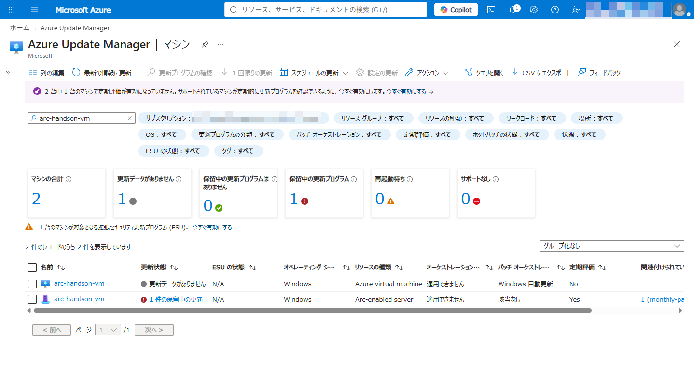

3. 対象サーバーをクリックして詳細ページを開く

### 手順 2-3: 定期評価を有効化する

1. 詳細ページ上部のボタンから「**設定の更新**」をクリック

   

2. 「更新プログラムの設定を変更する」ペインが開きます
3. 対象サーバーの「**定期評価**」列で「**有効**」を選択
4. 「**保存**」をクリック

   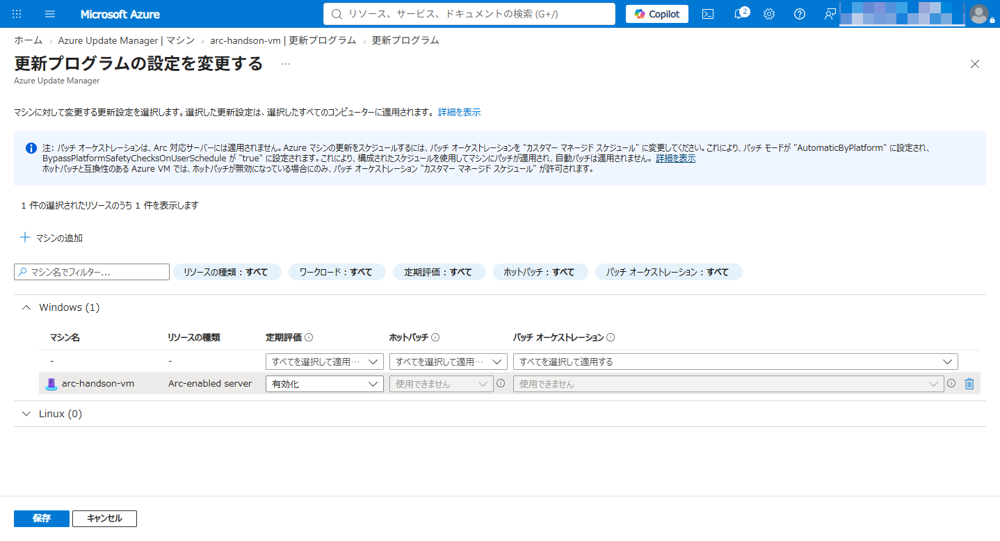

5. 設定が適用されるまで待機（通常 1～2 分）
6. マシン一覧に戻り、「定期評価」が「**有効**」に更新されたことを確認

---

## タスク 3: 更新コンプライアンスの確認

### 手順 3-1: コンプライアンス情報の表示

1. Update Manager のメイン ページに戻る
2. 左メニュー「**リソース**」→「**マシン**」をクリック
3. 対象サーバーをクリック
4. **「推奨される更新プログラム」タブ**をクリック（デフォルトで選択済み）

   > **注意**: 定期評価を有効にした直後はデータがない場合があります。「更新プログラムの確認」ボタンで手動で評価を実行してください。

   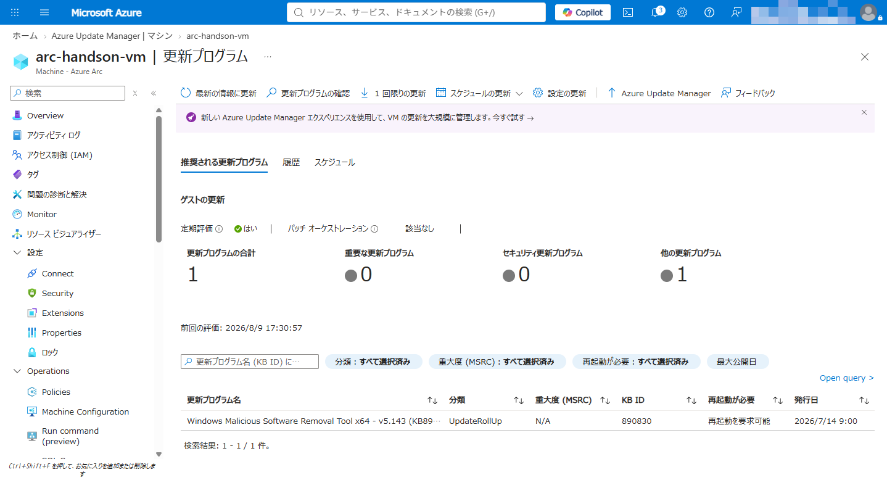

5. 利用可能な更新の一覧が表示されます
   - **保留中の更新**：まだ適用されていない更新
   - **セキュリティ更新**：特にセキュリティに関連する更新（優先度高）
   - **重要な更新**：Windows の安定性に関わる更新
   - **その他の更新**：それ以外の機能向上など

   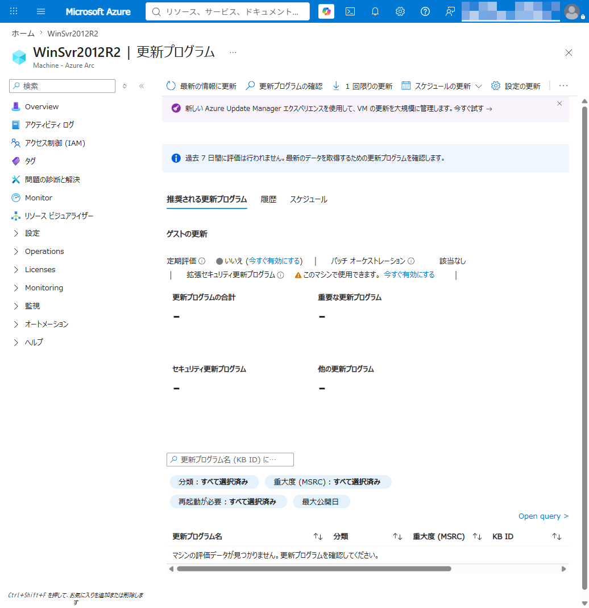

### 手順 3-2: 更新の詳細確認

1. 更新の一覧から任意の更新をクリック
2. **更新番号**（KB 番号）、**タイトル**、**重要度**などが表示されます

   

> **参考**：セキュリティ更新は必ず適用することが推奨されます。重要度が「重要」以上のものは優先度を高くしましょう。

## タスク 4: メンテナンス構成（定期更新スケジュール）の設定

メンテナンス構成を使用して、メンテナンス ウィンドウ内で定期的に更新を自動適用するスケジュールを設定します。

### 手順 4-1: メンテナンス構成ページを開く

1. Update Manager の左メニュー「**管理**」→「**メンテナンス構成**」をクリック

   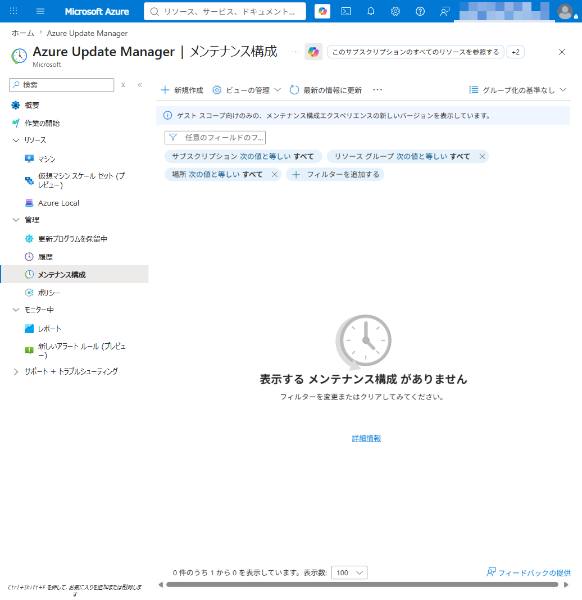

### 手順 4-2: 新しいメンテナンス構成を作成

1. 「**+ 新規作成**」をクリック

   

2. **メンテナンス構成の作成** フォームが開きます。以下を入力します：

   | 項目 | 入力値 | 説明 |
   |------|--------|------|
   | **サブスクリプション** | ご使用のサブスクリプション | |
   | **リソース グループ** | rg-arcservers | このラボで使用しているリソース グループ |
   | **構成名** | `Monthly-Patch-Tuesday` | 識別しやすい名前を入力 |
   | **地域** | Japan East | |
   | **OS** | Windows | 対象 OS を選択 |

   

### 手順 4-3: スケジュールの設定

1. **スケジュール** セクションで実行スケジュールを設定します
2. 以下の例を参考に設定してください：

   **例：毎月第 2 火曜日の午前 2:00 に実行**

   - **繰り返し**：「毎月」を選択
   - **実行日時**：「第 2 火曜日」「午前 2:00」を選択
   - **タイムゾーン**：「Asia/Tokyo」を選択（お使いの地域に合わせて変更）
   - **メンテナンス ウィンドウ**：「2 時間」を指定（更新に必要な時間を想定）

   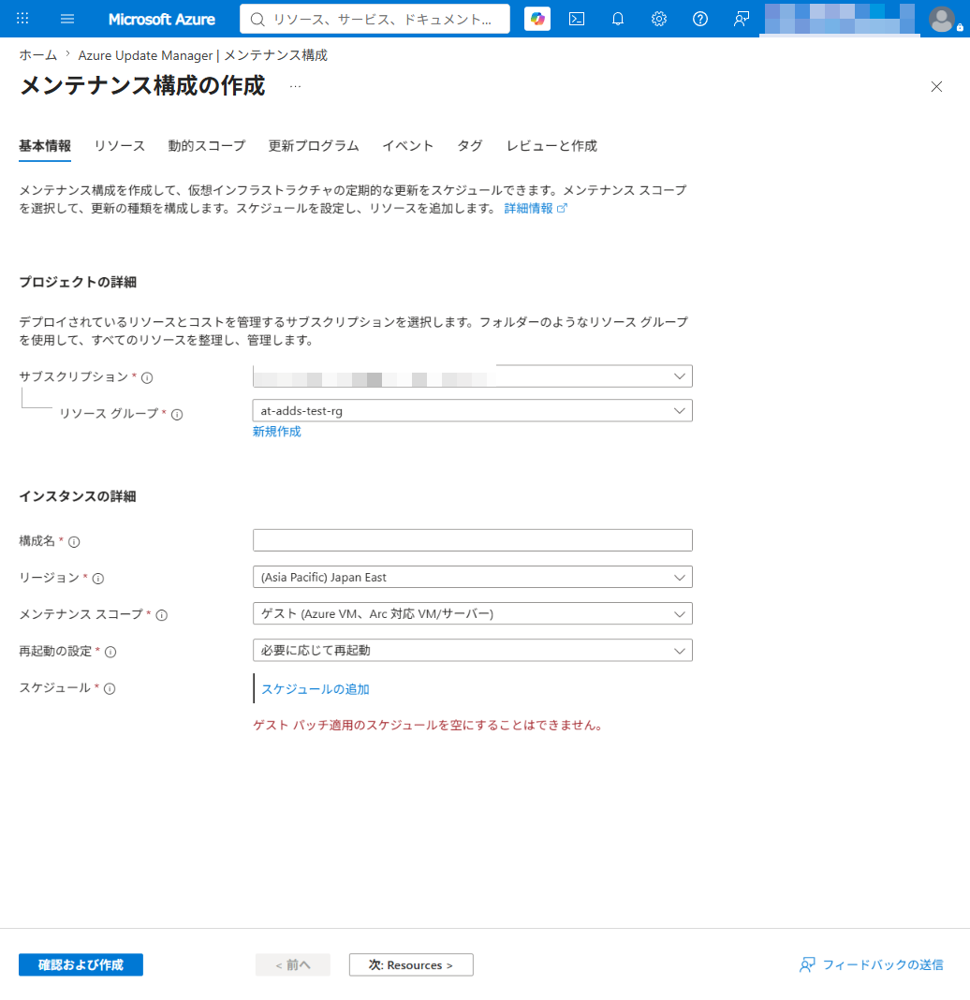

### 手順 4-4: 更新プログラムの種類を選択

1. **更新プログラムの追加** セクションで適用する更新の種類を選択：
   - **セキュリティ更新**：✓
   - **重要な更新**：✓

   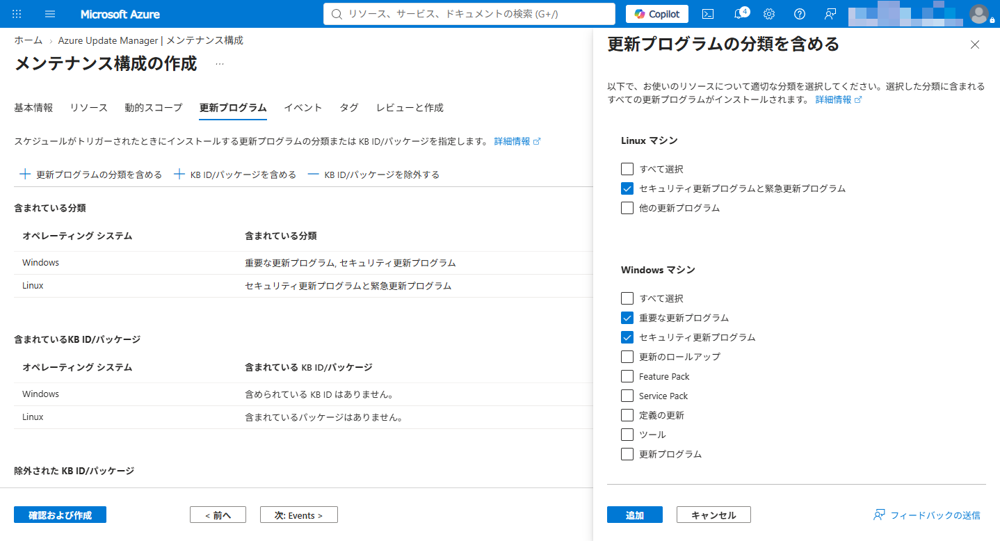

### 手順 4-5: スコープ（対象マシン）を設定

1. 「**スコープ**」タブをクリック
2. 「**+ スコープを追加する**」または「**+ マシンの追加**」をクリック
3. 対象の Arc 対応サーバーを選択

   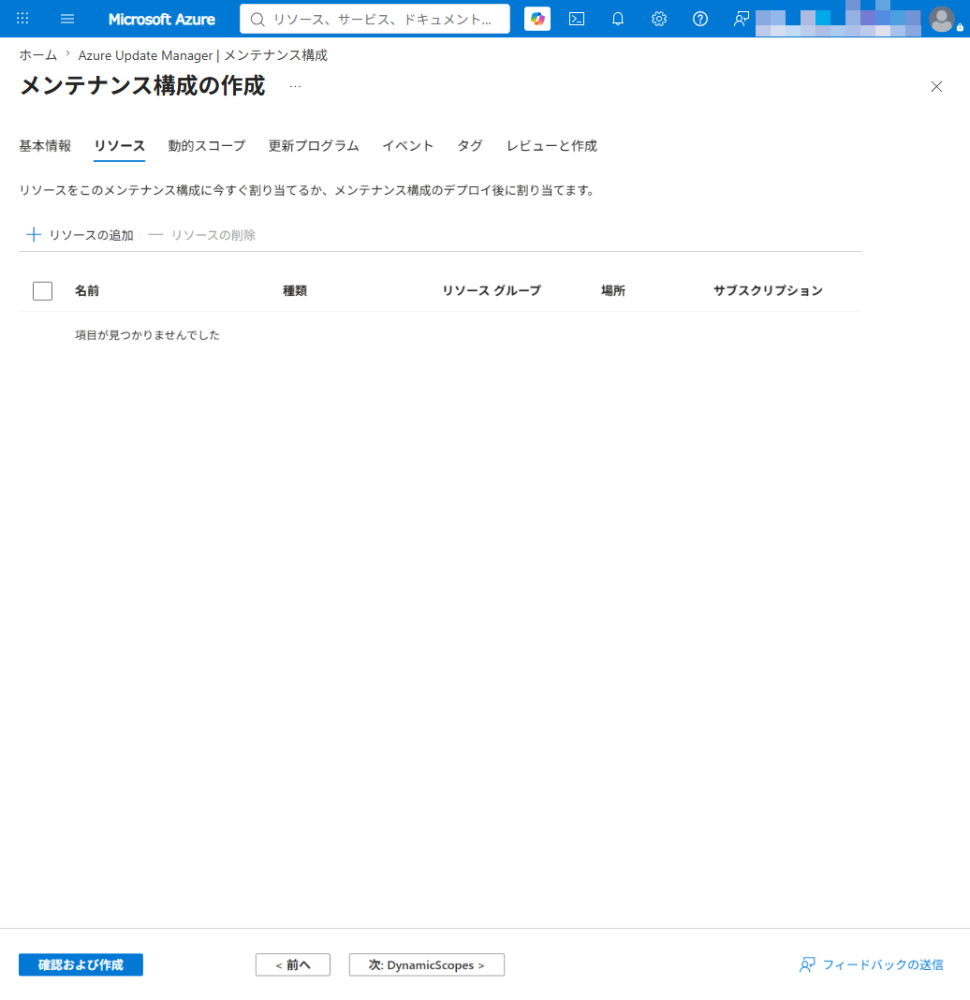

### 手順 4-6: メンテナンス構成の作成完了

1. すべての設定を確認し「**確認および作成**」をクリック
2. 検証が完了したら「**作成**」をクリック

   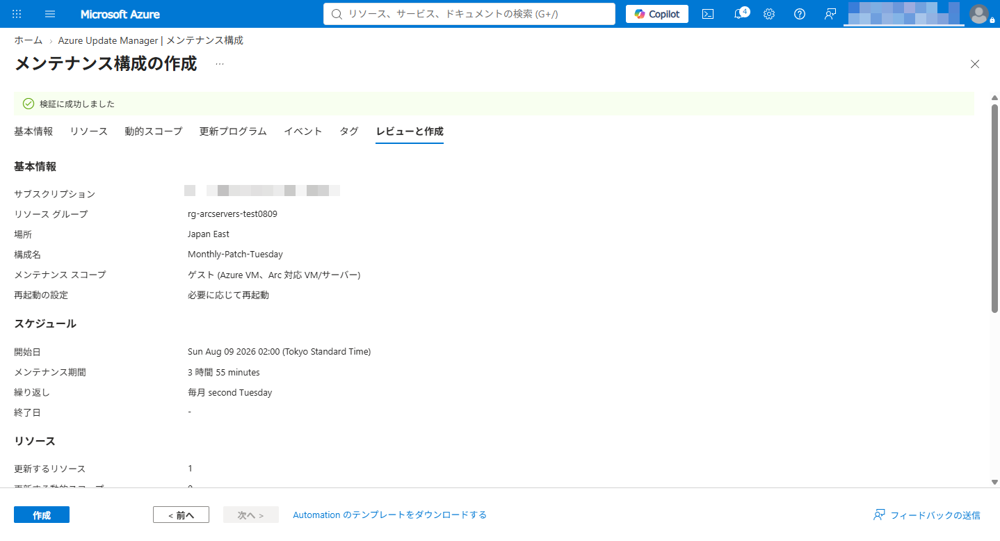

3. メンテナンス構成が正常に作成されたことを確認
   - 一覧に新しいメンテナンス構成が表示されます

   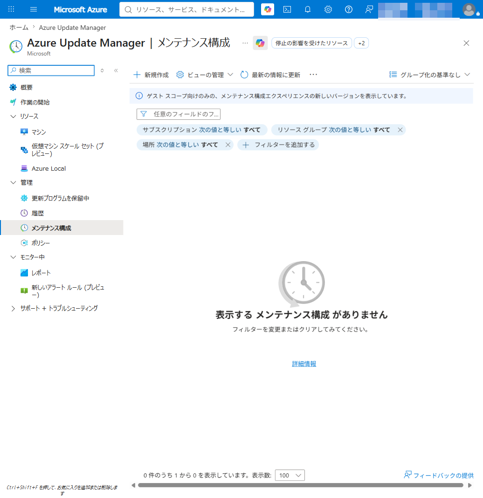

## タスク 5: 1 回限りの更新（即時更新の適用）

すぐに更新を適用したい場合、「1 回限りの更新」を使用します。

### 手順 5-1: 1 回限りの更新を開始

1. Update Manager のマシン ページから、対象サーバーをクリック
2. まず「**更新プログラムの確認**」をクリックして最新の評価データを取得する

   > **注意**: 最新の更新データがない状態では更新を適用できません。評価完了まで数分かかる場合があります。

   

3. 評価が完了したら、「**1 回限りの更新**」をクリック

   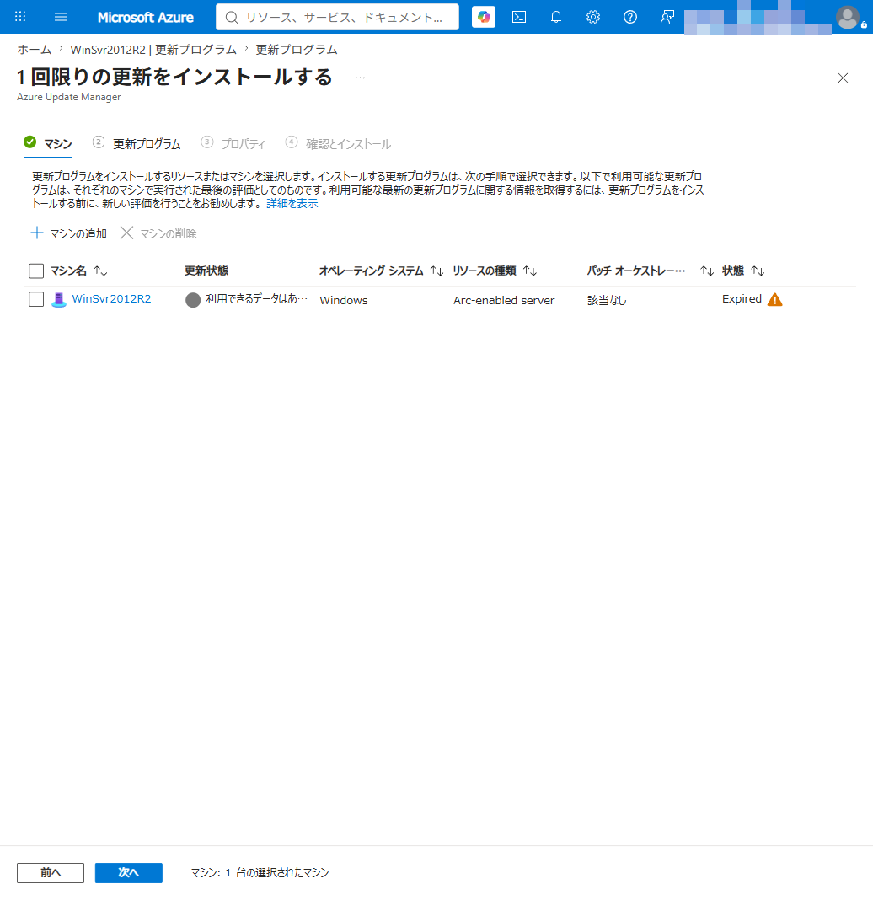

### 手順 5-2: 更新の選択

1. 「今すぐ更新プログラムをインストール」ウィンドウが開きます
2. 適用する更新の種類を選択：
   - **セキュリティ更新**：✓（推奨）
   - **重要な更新**：✓（推奨）
   - 個別に更新を選択することも可能

   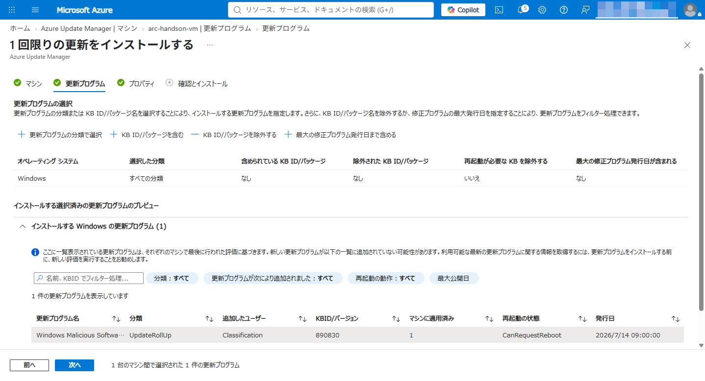

3. 「**次へ**」をクリック

### 手順 5-3: 再起動オプションの確認

1. **再起動オプション** を選択：
   - **必要な場合は再起動**（推奨）
   - 再起動しない（一部の更新は効果がない場合があります）

   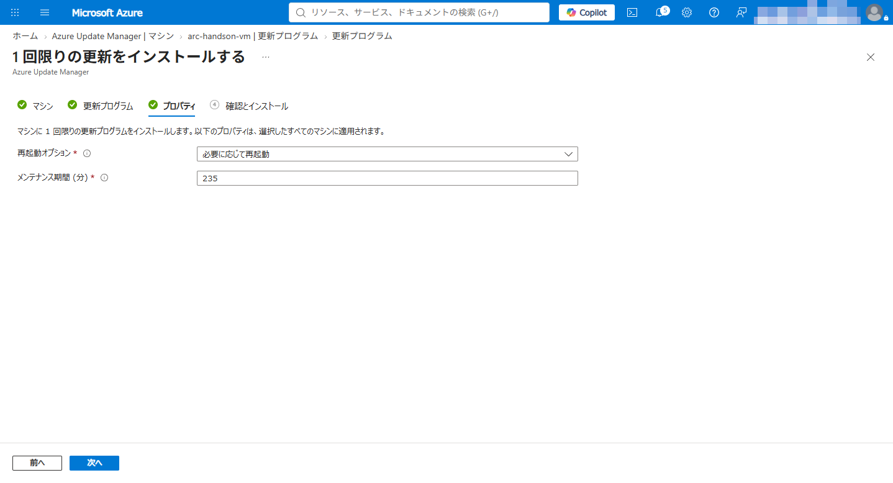

2. 「**インストール**」をクリックして更新を開始

### 手順 5-4: 更新の進行状況を確認

1. 更新の適用が開始されます
2. 「**履歴**」タブから実行状況を確認できます

   > **参考**: 更新実行中は「実行中」ステータスが表示されます。完了すると「成功」または「失敗」に変わります。

3. 更新が完了すると「**成功**」ステータスが表示されます

## タスク 6: 更新履歴の確認と監視

### 手順 6-1: 更新履歴の表示

1. 対象サーバーの詳細ページで、**「履歴」タブ**をクリック

   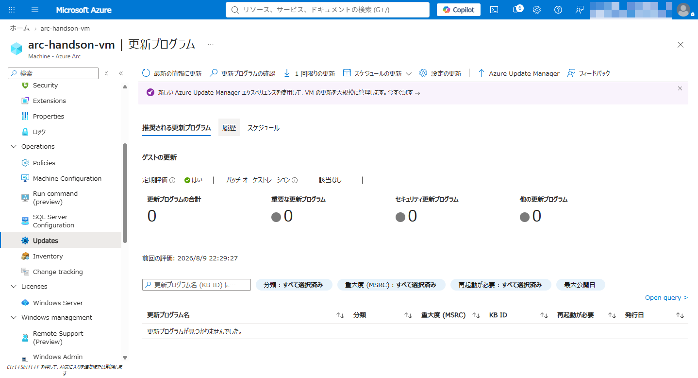

2. 以下の情報が表示されます：
   - **実行日時**：いつ更新を実行したか
   - **更新数**：適用した更新の総数
   - **成功/失敗**：更新の結果
   - **再起動の有無**：サーバーが再起動したかどうか

   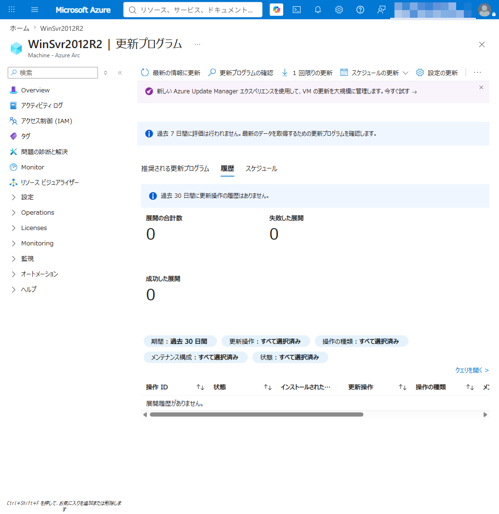

### 手順 6-2: 実行結果の詳細確認

1. 履歴の任意の実行結果をクリック
2. **詳細レポート** が表示されます：
   - 適用された更新の一覧（KB 番号、タイトル、状態）
   - エラーが発生した場合、エラーメッセージ
   - 再起動の時刻

   > **参考**: 更新を実際に実行した後、実行結果行をクリックすると適用された更新の詳細一覧が確認できます。

### 手順 6-3: 概要ページでの一元監視

1. Update Manager のメイン ページに戻る
2. 左メニューから「**概要**」をクリック

   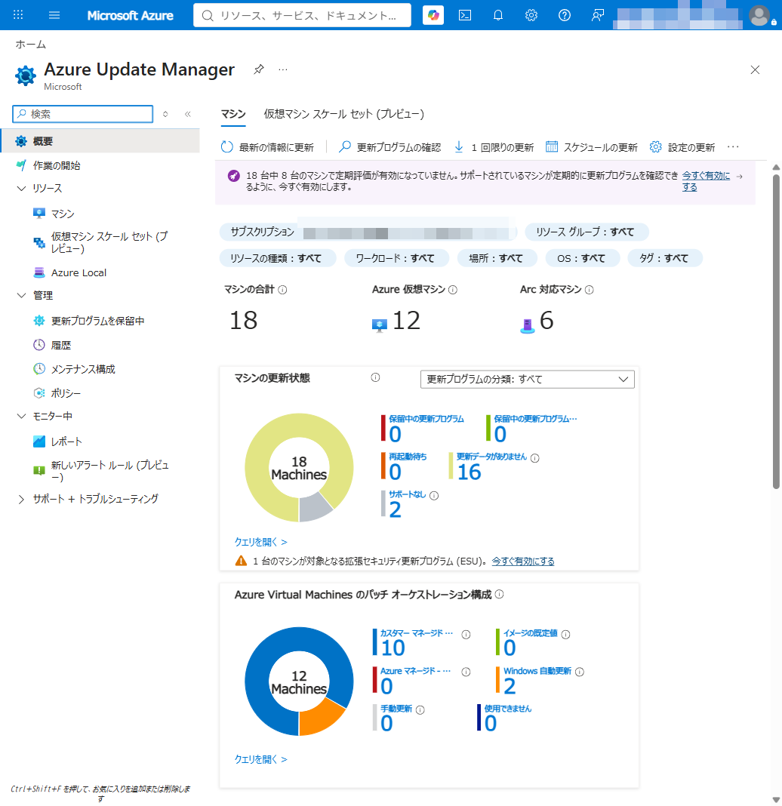

3. 以下の情報が表示されます：
   - **マシンのコンプライアンス状況**：全体的な更新状況（マシン数・更新状態の内訳）
   - **保留中の更新数**：対応が必要な更新
   - **パッチ オーケストレーション構成**：各マシンのパッチ設定

   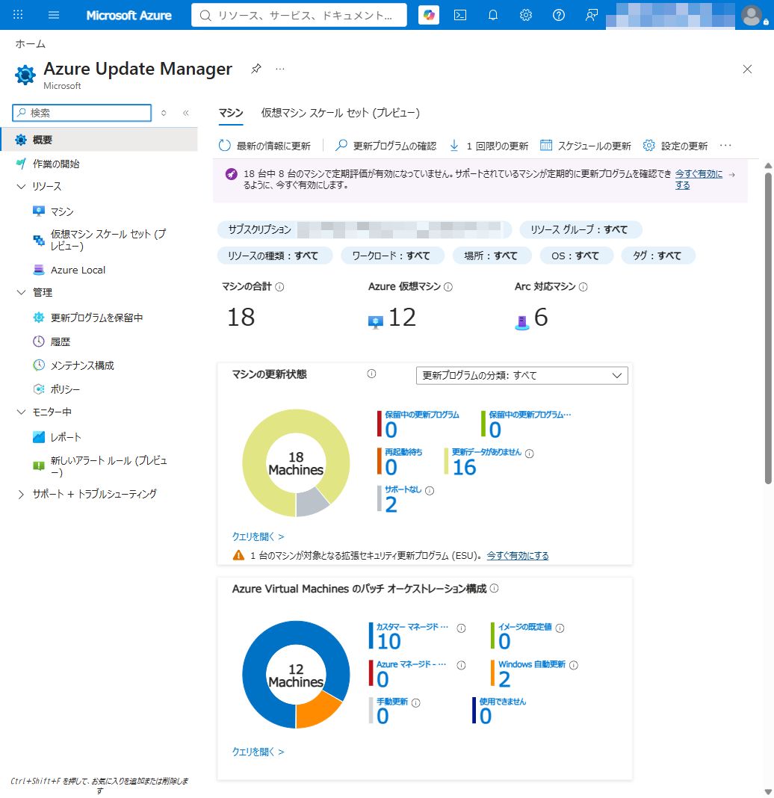

## まとめ

このモジュールでは、以下を習得しました：

✅ Update Manager の基本概念  
✅ 定期評価の有効化と更新設定の構成  
✅ 更新コンプライアンスの確認  
✅ メンテナンス構成（定期更新スケジュール）の設定  
✅ 1 回限りの更新（即時更新）の適用  
✅ 更新履歴の監視  

## 次のステップ

- [モジュール 5: Azure Arc Insights Power BI ダッシュボード](./module05.md) に進む場合は、Power BI Desktop をインストールしてください
- [モジュール 99: リソースのクリーンアップ](./module99.md) に進む場合は、作成したメンテナンス構成の削除を検討してください
- 複数のサーバーがある場合は、同じ手順を繰り返してすべてのサーバーに Update Manager を適用

## 関連リソース

- [Azure Update Manager のドキュメント](https://learn.microsoft.com/ja-jp/azure/update-center/overview)
- [Azure Arc の概要](https://learn.microsoft.com/ja-jp/azure/azure-arc/servers/overview)
- [Windows のセキュリティ更新について](https://learn.microsoft.com/ja-jp/windows/release-health/windows-release-health)

